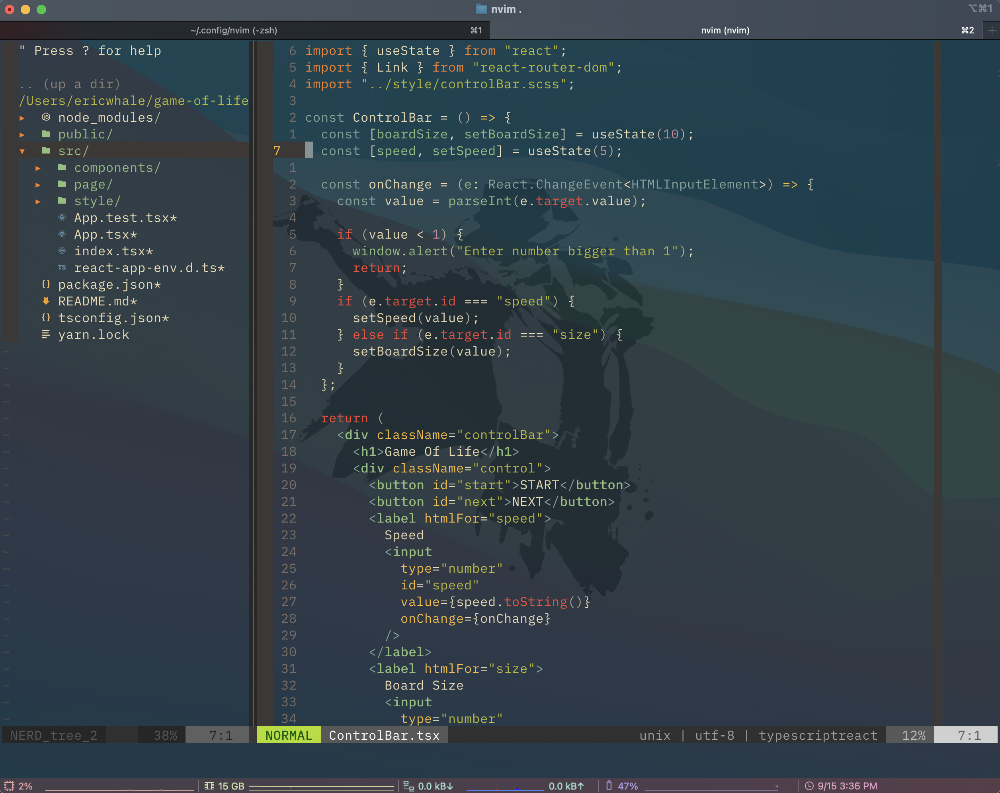

# vimrc

This is my personal Neovim config repo. Feel free to fork/clone the repo.

I also use **CoC** for auto completion. This is the [link](https://github.com/eric8979/my-coc).

## Basics

(Mastering the Vim Language)[https://www.youtube.com/watch?v=wlR5gYd6um0&list=WL&index=59]

- Commands = Verb + Noun
  repeatable (`.`), undoable (`u`)

- Verb

  - `d`: delete
  - `c`: change (delete & insert mode)
  - `>`: indent
  - `v`: visually select
  - `y`: yank(copy)

- Noun

  - Motions

    - `w`: word (forward by a "word")
    - `b`: back (backward by a "word")
    - `hjkl`: arrows

  - Text Objects

    - `i"`: inner quotes
    - `ip`: inner paragraph (chunk)
    - `it`: inner tag (html, xml)
    - `diw`: delete inner word
    - `ciw`: delete inner word

  - Parameterized Text Objects

    - `f`, `F`: find the next character
    - `t`, `T`: find the next character (one char before)
    - `/`: Search (up to the next match)
    - `?`: Search (up to the previous match)
    - `d/<qurey>`: delete from the cursor to the first query

---

## Commands

### Delete

- `di{`
  erase everything in {}

- `da{`
  erase everything in {} and {} itself

- `Ctrl + ^`
  swap between last two files

### Mark

- `m<capital letter>` `'<capital letter>`
  mark a position globally
  ex) mH - 'H

### Split Screen

- `Ctrl + w + v`
  vertical

- `Ctrl + w + s`
  horizontal

- `Ctrl + w + o`
  close all but current buffer

- `:resize 10`
  resize window to 10 rows (horizontally)

- `:vertical resize 20`
  resize window to 20 columns (vertically)

- `Ctrl + w + =`
  evenly spread all windows

- `Ctrl + w + r`
  swap windows

- `Ctrl + w + H`
  vertical to horizontal

### Substitue (find and replace)

- `:s/<search_term>/<replace_term>/option`
  option: c (confirmation), g (replace all in the line), i (ignore case)

- `:%s/<search_term>/<replace_term>/g`
  replace all in the file

### Tabpage

- `nvim -p <filename><…>`
  open files on tabs when start nvim

- `:tabnew`
  open new empty tab

- `:tabc`
  close current tab

- `:tabo`
  close all other tab pages

- `:{count}tabn`
  go to next (or count if count is provided) tab page
